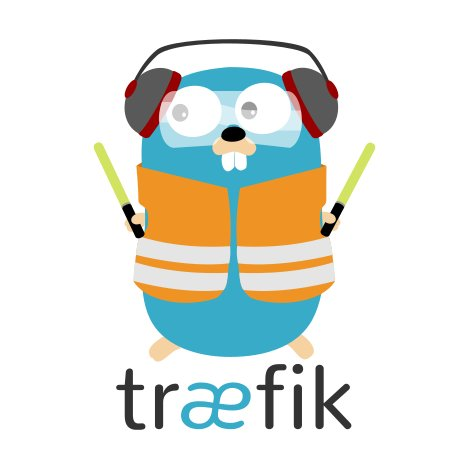

# C9-App

Application to authenticate users against Active Directory and create a cloud9 container for them while mounting a user's home directory and handling user mapping to retain user permission outside the container for NFS shares.

## Technologies

### Frontend

| [](https://nodejs.org) | [](https://expressjs.com) | [](https://www.passportjs.org) | [](https://mongoosejs.com) |
|:---:|:---:|:---:|:---:|
| https://nodejs.org | https://expressjs.com | https://www.passportjs.org | https://mongoosejs.com |

### Backend

| [](https://kubernetes.io) | [](https://traefik.io) | [](https://www.mongodb.com) | [](https://gitlab.com) | [](https://www.docker.com) |
|:---:|:---:|:---:|:---:|
| https://kubernetes.io | https://traefik.io | https://www.mongodb.com | https://gitlab.com | https://www.docker.com |

### NPM

Main NPM Module that interacts with Kubernetes:

[kubernetes-client](https://github.com/godaddy/kubernetes-client)

### Cloud9 IDE Container

The container image this entire project started around is [mstev0du/cloud9-ide:latest](https://hub.docker.com/r/mstev0du/cloud9-ide) with over 500K pulls so far!!! Thanks for all the love!

To only run the cloud9-ide docker image locally:

```
docker run -it -d --name cloud-ide --user=0:0 -p 80:80 mstev0du/cloud9-ide:latest
```
Navigate to a browser [http://localhost](http://localhost)

Enjoy your very own ide in a browser.

## Installation

Clone this repository.

```
git clone https://github.com/mst3v3nsn/c9-app.git
cd c9-app
```

Edit files in manifests/ specific to your environment. I used mine with Gitlab-CI which is why most of the YAML files are templated.

Make sure you are using [Traefik](https://docs.traefik.io/configuration/backends/kubernetes/) as your proxy service and have your certs saved as secrets within Kubernetes. I highly recommend Traefik.

## Usage

```
cd manifests
kubectl create -f c9-app.yaml
kubectl create -f c9-service.yaml
kubectl create -f c9-ingress.yaml
```

## Contributing
Pull requests are welcome. For major changes, please open an issue first to discuss what you would like to change.

Please make sure to update tests as appropriate.

## License
[MIT](https://choosealicense.com/licenses/mit/)
